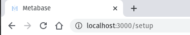
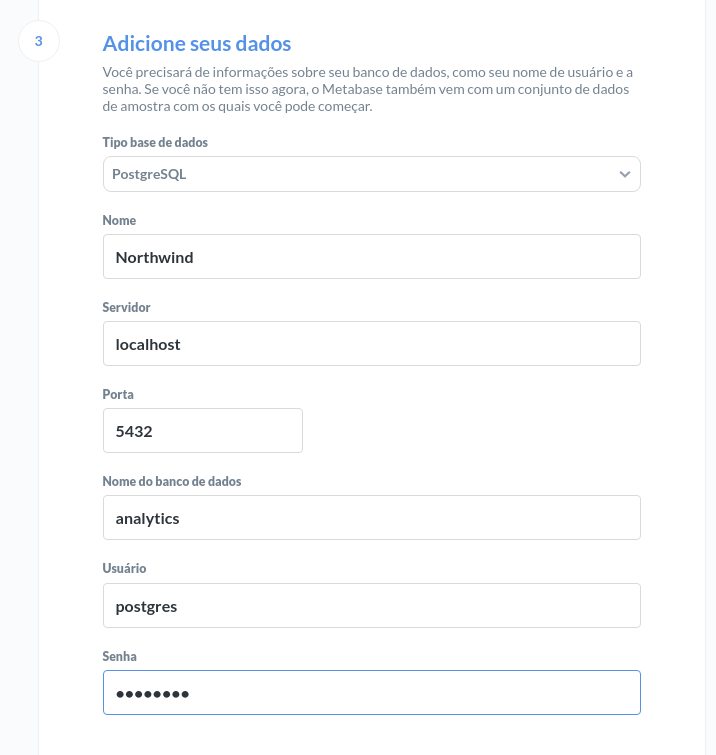

# Visualizando dados no Metabase

Em nosso livro Analytics Engineering apresentamos diferentes ferramentas de Visualização de Dados que podemos utilizar na prática para criar os mesmos painéis e relatórios. Embora a maioria das ferramentas sejam proprietárias, há algumas opções open-source como o [Metabase](https://www.metabase.com/), [Redash](https://redash.io/) ou [Superset](https://superset.apache.org/).

Vamos mostrar como instalar o Metabase na sua máquina local utilizando Docker

## Levantando uma instância do Metabase

Para criar rapidamente uma instãncia do metabase você pode rodar a linha abaixo no terminal:

```
docker run -d -p 3000:3000 --network host --name metabase metabase/metabase
```

Depois do download da imagem, o Metabase vai estar disponível no seu navegador na porta padrão 3000:



Na seção "Adicione seus dados", insira as credenciais do seu DW e comece a visualizar (no exemplo abaixo utilizamos o banco Postgres local criado anteriormente):



## Cuidado!

Se você pretende utilizar o Metabase criado acima para uso em projetos reais deve tomar alguns cuidados para não perder os dados do Metabase em caso de falhas no computador ou acidentalmente apagar a imagem do docker. Siga as instruções [aqui](https://www.metabase.com/docs/latest/operations-guide/running-metabase-on-docker.html) ou consulte um profissional especializado na área.